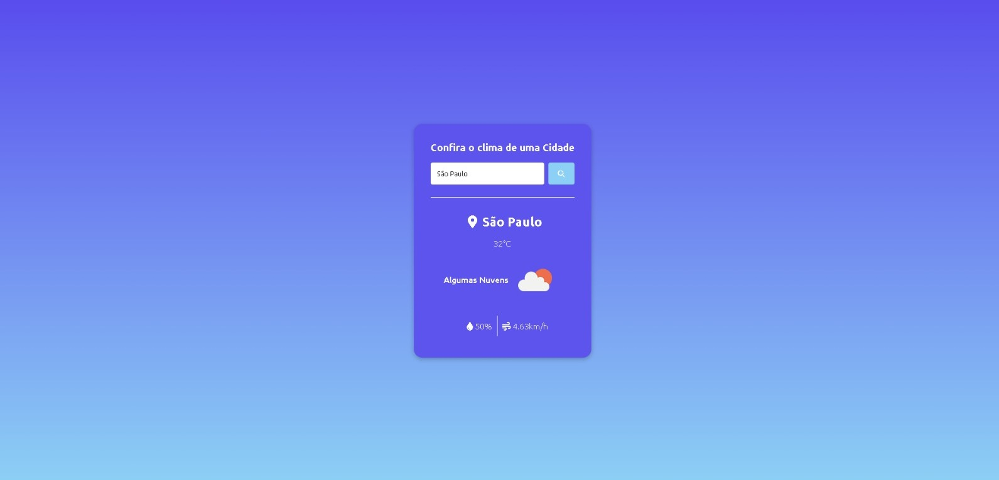

<h1 align="center">Clima Agora</h1>
 

<h1>
        
</h1>

Explore as condições climáticas de qualquer cidade com o "Clima Agora". Basta digitar o nome da cidade, clicar em "Procurar" e obter instantaneamente a previsão do tempo, temperatura, umidade e velocidade do vento. Uma maneira fácil e eficaz de manter-se informado sobre as condições climáticas locais.

<h1>Como Funciona</h1>
<h3>Estrutura do Projeto</h3>
O projeto é composto por três arquivos principais:

- index.html: O arquivo HTML contém a estrutura da página, definindo os elementos da interface do usuário e incorporando as bibliotecas necessárias.

- style.css: O arquivo CSS fornece estilos e formatação à interface, garantindo uma experiência visual atraente e responsiva.

- script.js: O arquivo JavaScript contém a lógica de interação com o usuário e a integração com a API de previsão do tempo.

<h3>API de Previsão do Tempo</h3>
O "Clima Agora" utiliza a API de previsão do tempo da OpenWeather para obter dados precisos e em tempo real sobre as condições climáticas da cidade pesquisada. 

<h3>Funcionalidades Principais</h3>

- Pesquisa por Cidade: Os usuários podem inserir o nome da cidade desejada no campo de pesquisa
  e clicar no botão de busca.

- Exibição de Dados: Após a pesquisa, o "Clima Agora" exibe informações essenciais, como temperatura, descrição do tempo, umidade, velocidade do vento e ícone representativo das condições climáticas.

- Visualização Intuitiva: A interface do usuário é projetada para ser intuitiva, proporcionando uma experiência agradável para quem busca informações rápidas sobre o clima.

<h2>Acesse o Site</h2>
Confira o "Clima Agora" em  https://lapiedradaniel.github.io/Clima/ para experimentar as funcionalidades em tempo real.

<h2>Tecnologias Utilizadas</h2>

- HTML 
- CSS
- JavaScript
 Essenciais para o desenvolvimento da interface amigável e interativa do "Clima Agora".

 
  
  
          

